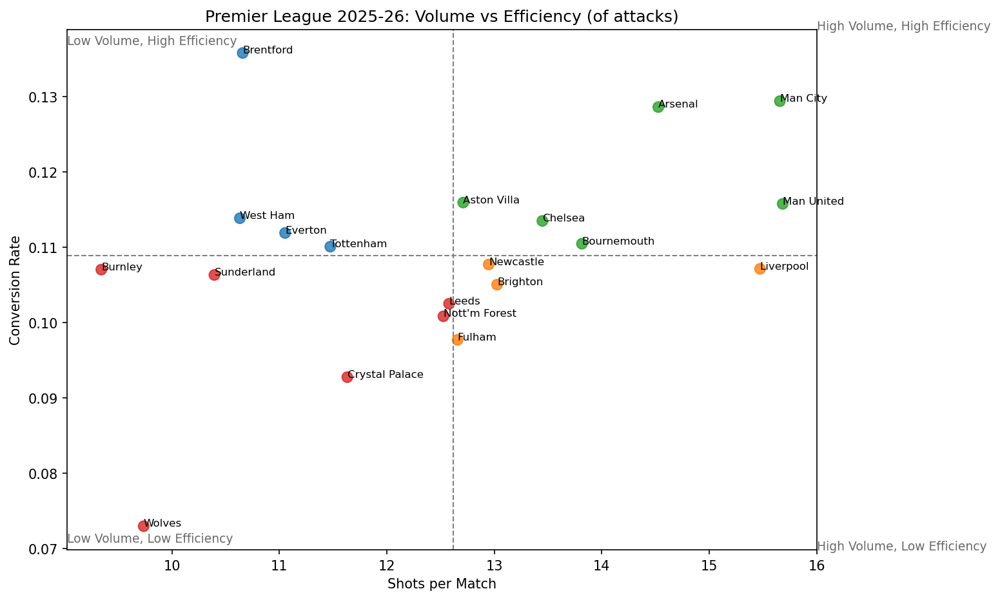
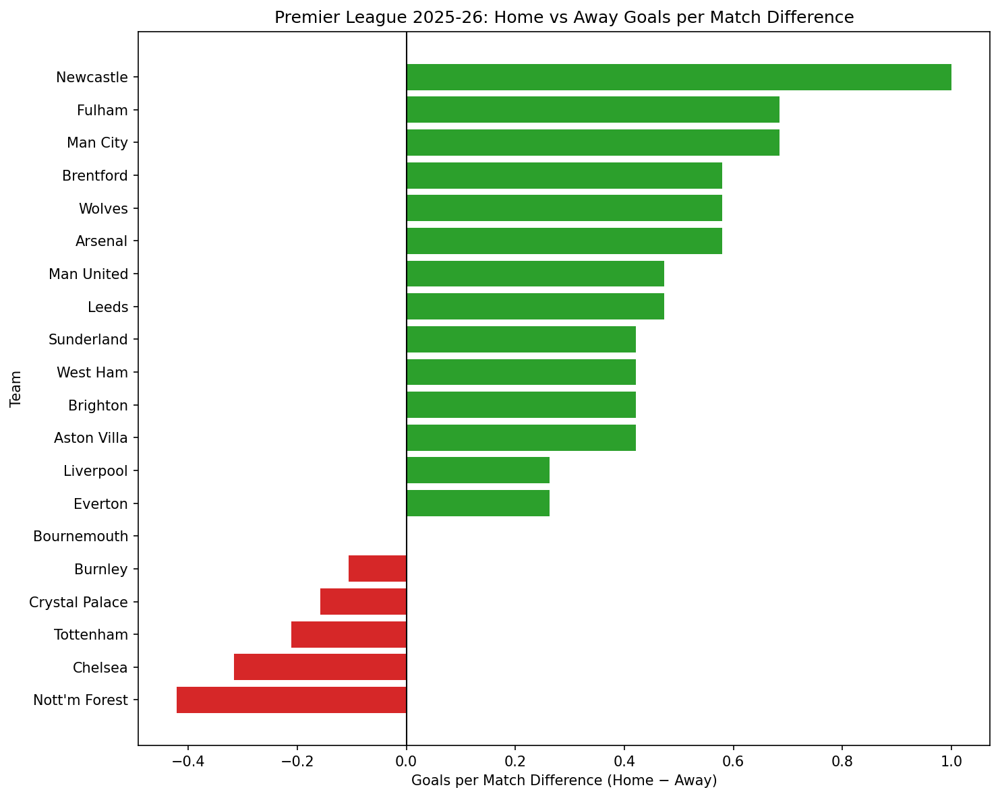

# Analysing Attacking Performance in the 2025-26 Premier League Using Goals, Shots and Shots on Target

An analysis of shot volume, shot efficiency, and goal output across all 20 Premier League clubs in the 2025-26 season, including a breakdown of how attacking performance differs between home and away venues.

## What this analysis covers

Using match-level shot and goal data, this project computes five core attacking metrics for every club — Shots per Match, Shots on Target per Match, Shot Accuracy, Conversion Rate, and Goals per Match — then examines them from two angles:

1. **Season-long attacking performance** — who generates the most attacking volume, who finishes most efficiently, and how those two things relate (or don't) to actual goal output.
2. **Home vs. away splits** — whether a team's attacking output and efficiency shift depending on venue, and what might explain those shifts.

## Key findings

- **Brentford** posted the league's highest shot accuracy *and* highest conversion rate, despite ranking in the bottom five for shot volume — the clearest "quality over quantity" attacking profile in the league.
- **Manchester City and Arsenal** topped the goals-per-match leaderboard without leading in shot volume, showing that elite finishing — not sheer chance creation — drove their attacking output.

*Shot volume and shot efficiency show no consistent relationship across the league — Brentford anchors the "low volume, high efficiency" corner, while Liverpool sits almost opposite.*

- **Newcastle** posted the most extreme home-field advantage of any club, ranking 1st in three of the four home/away difference metrics and 2nd in the fourth — no other team swept every metric.
- **Nottingham Forest and Chelsea** showed a genuinely counterintuitive pattern: both took significantly more shots at home, yet converted and finished far better away — a case where attacking volume and attacking quality moved in opposite directions by venue.

*Newcastle and Fulham lean sharply home-boosted, Forest, Chelsea, Tottenham and Palace lean away-boosted, and Bournemouth sits almost exactly at zero — the clearest neutral case in the league.*

- **Sunderland** finished 7th and qualified for the Europa League despite modest attacking numbers across the board — a reminder that attacking metrics alone don't fully explain league outcomes.

## Project structure

The full analysis, including all code, charts, and write-ups, is contained in a single Jupyter notebook:

📓 [`Analysing_Attacking_Performance_in_the_2025-26_Premier_League_Using_Goals__Shots_and_Shots_on_Target.ipynb`](./Analysing_Attacking_Performance_in_the_2025-26_Premier_League_Using_Goals__Shots_and_Shots_on_Target.ipynb)

The notebook is organised into five parts:

1. **Introduction & Methodology** — the five metrics used and why
2. **Part One: Overall Attacking Performance** — volume, efficiency, and output across the full season
3. **Part Two: Home vs. Away Splits** — how attacking performance shifts by venue
4. **Limitations of the Analysis** — what the data can and can't prove
5. **Appendix** — a full 20-team reference table, sorted by final league position

## Data source

[Football-Data.co.uk](https://www.football-data.co.uk/mmz4281/2526/E0.csv) — 2025-26 Premier League match results and statistics.

## Tools used

Python, pandas, and matplotlib.

## How to run

1. Clone this repo or download the notebook
2. Open it in Jupyter Notebook / JupyterLab
3. Run all cells — data is pulled live from Football-Data.co.uk, no local file needed

**Requirements:** Python 3.x, pandas, matplotlib
